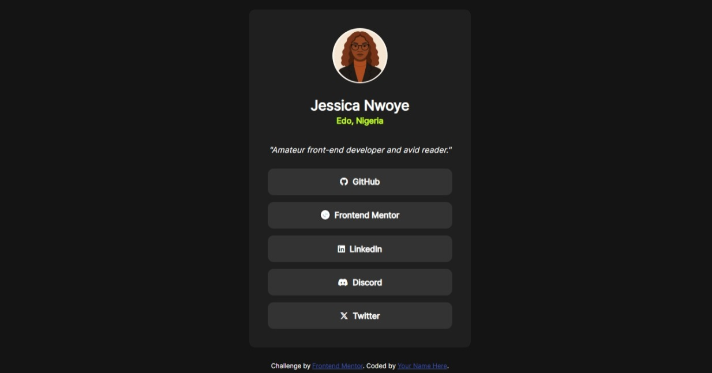

# Frontend Mentor - Social links profile solution

This is a solution to the [Social links profile challenge on Frontend Mentor](https://www.frontendmentor.io/challenges/social-links-profile-UG32l9m6dQ). Frontend Mentor challenges help you improve your coding skills by building realistic projects.

## Table of contents

- [Overview](#overview)
  - [The challenge](#the-challenge)
  - [Screenshot](#screenshot)
  - [Links](#links)
- [My process](#my-process)
  - [Built with](#built-with)
  - [What I learned](#what-i-learned)
  - [Continued development](#continued-development)
- [Author](#author)

## Overview

### The challenge

Users should be able to:

- See hover and focus states for all interactive elements on the page

### Screenshot



**Hover State**


### Links

- Solution URL: [Solution URL](https://www.frontendmentor.io/solutions/responsive-social-links-profile-page-using-css-flexbox-KCFTXDtEPf)
- Live Site URL: [Live site URL](https://jesnetwd.github.io/Social-links-profile-Frontend-Mentor/)

## My process

### Built with

- Semantic HTML5 markup
- CSS custom properties
- Flexbox

### What I learned

I learnt how to use min-height to center elements that are larger than the viewport. I also learnt how to use media queries in aiding responsiveness.
I also learnt about using font awesome to add icons to my webpage.

```html
<a href="https://github.com/JesNetWD" class="social-btn"
  ><i class="fa-brands fa-github"></i> &nbsp;GitHub</a
>
<a
  href="https://www.linkedin.com/in/jessica-nwoye-45330b311/"
  class="social-btn"
  ><i class="fa-brands fa-linkedin"></i> &nbsp;LinkedIn</a
>
<a href="https://www.discordapp.com/users/la_zjes" class="social-btn"
  ><i class="fa-brands fa-discord"></i> &nbsp;Discord</a
>
<a href="#" class="social-btn"
  ><i class="fa-brands fa-x-twitter"></i> &nbsp;Twitter</a
>
```

```css
.container {
  min-height: 100vh;
  display: flex;
  flex-direction: column;
  justify-content: center;
  align-items: center;
}

@media screen and (max-width: 600px) {
  .profile {
    min-width: unset;
    width: 90%;
    margin: 1em;
  }
}
```

### Continued development

I need to plan my projects better, several times I've looked at the design and thought I already knew how to do it only to have something come up.
I also need to write cleaner code.

## Author

- LinkedIn - [Jessica Nwoye](https://www.linkedin.com/in/jessica-nwoye-45330b311/)
- Frontend Mentor - [@JesNetWD](https://www.frontendmentor.io/profile/JesNetWD)
